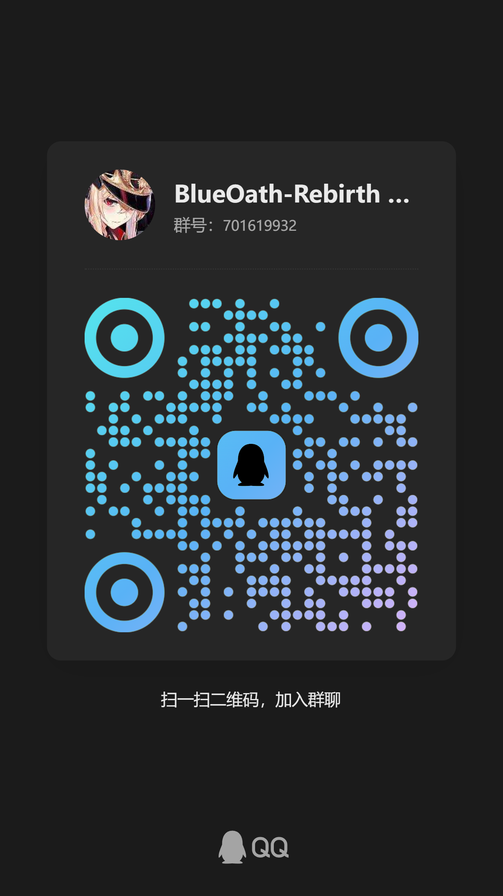
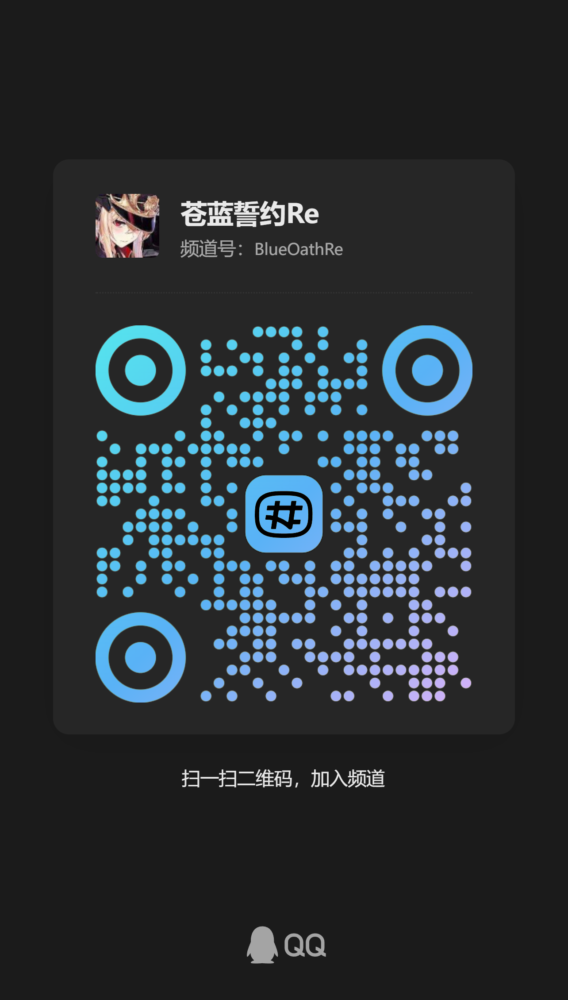

<div align="center">

# BlueOath Rebirth

**某款已关服 Unity 手游的本地离线复原工程** — 从日服/国服客户端还原出可一键启动的本地服务端与 Mod 环境。


</div>

---

## 项目简介

某游戏是一款基于 **Unity IL2CPP**（C# 已编译不可读）与 **Lua 热更**（逻辑近乎明文）的手游，目前已关服。本项目通过逆向还原其网络协议、配置数据与客户端逻辑，搭建一套本地离线服务端，让游戏能够**离线状态下一键运行**，并在此之上提供 **Mod 支持**（xLua 运行时执行外部 Lua 代码），目标在日服与国服客户端之间通用。

原始日服与国服客户端目录保持不变；协议、IL2CPP 类型与配置知识库均由工具**可重复生成**。

## 特性

- ✅ **本地离线服务端** — `BlueOath.Server`：HTTP 引导 + 游戏登录（TCP 与 UDP）双端点，SQLite 存档，仅监听 `127.0.0.1`
- ✅ **真实传输协议还原** — 11 字节应用层头 + protobuf 信封；TCP over UDP（`KcpCodec` + ARQ 可靠性）
- ✅ **客户端注入与重定向** — x86 注入 DLL（xinput 劫持）：SDK 登录绕过、DNS/connect/TLS 重定向、UnityTLS 证书信任补丁、引导系统跳过
- ✅ **配置数据库双向转换** — 解密 `config_*.db`（XOR 0x55）⇄ Excel ⇄ C# 强类型类，一键脚本导出/反导
- ✅ **协议/类型/配置知识库** — `BlueOath.Tools` 只读分析生成 `docs/*-catalog`，含 `.proto` 草案与 wire 证据
- ✅ **WPF 图形化启动器** — 公告面板、进程守护、日志控制台、一键完整启动流程
- ✅ **Mod 支持（实验）** — xLua Mod Loader：Payload 内钩取 `lua_pcallk`，从游戏 Lua 线程执行 `Mods/bootstrap.lua`，支持内容覆盖与追加（新增章节/装备/舰船）

## 目录

- [快速开始](#快速开始)
- [构建与测试](#构建与测试)
- [使用方式](#使用方式)
- [项目结构](#项目结构)
- [当前进度](#当前进度)
- [文档](#文档)
- [Roadmap 与更新日志](#roadmap-与更新日志)
- [免责声明](#免责声明)

## 快速开始

### 前提条件

在开始前，您必须在本项目根目录下放置某游戏的客户端。

请参见：[项目结构](#项目结构)

### 方式一：WPF 图形化启动器（推荐）

请执行以下命令：

```powershell
dotnet run --project src\BlueOath.Launcher.Wpf\BlueOath.Launcher.Wpf.csproj
```

启动器会执行完整流程：清理残留进程 → TLS 证书生成 → 启动服务器 → 启动代理 → 注入游戏，并实时显示各进程状态与日志。

### 方式二：命令行脚本

```powershell
.\run-game.bat          # 全流程：server + proxy + 注入 + 看日志
.\start-client.bat      # 调试：仅 proxy + 客户端，连接已运行服务器
```

### 手动运行本地服务

```powershell
# 本地服务（HTTP 引导 + TCP 游戏登录）
dotnet run --project .\src\BlueOath.Server\BlueOath.Server.csproj -- --port=0 --region=jp --data=.\runtime\jp

# KCP over UDP 登录端点（真实传输）
dotnet run --project .\src\BlueOath.Server\BlueOath.Server.csproj -- --port=0 --kcp-game-login-port=0 --region=jp --data=.\runtime\jp
```

服务只监听 `127.0.0.1`，启动时输出 JSON 健康信息与实际端口。

## 构建与测试

```powershell
dotnet restore .\BlueOath.Local.sln
dotnet build .\BlueOath.Local.sln --no-restore          # 必须 0 警告 0 错误
dotnet run --project .\src\BlueOath.Tests\BlueOath.Tests.csproj --no-build
dotnet run --project .\src\BlueOath.Tests\BlueOath.Tests.csproj --no-build -- --integration

# 构建原生注入组件（payload + injector）
powershell -File .\tools\build-native.ps1
```

## 使用方式

### 客户端配置数据库 ⇄ Excel ⇄ C#

游戏配置存储于 SQLite `config_*.db`，`jsonbytes` 为明文 JSON 逐字节 `XOR 0x55`（可逆）。

```powershell
.\export-config.bat [jp|cn]    # 导出所有 config_*.db -> <仓库>\excel
.\import-config.bat [jp|cn]    # 反导回配置数据库（自动备份）
.\generate-config-cs.bat [jp|cn]  # 生成 C# 强类型类 -> src\BlueOath.Server\configs
```

底层命令与完整格式说明见 [配置工具链](docs/config-catalog/tooling.zh-CN.md)。

### 协议 / 类型 / 配置知识库生成

```powershell
dotnet run --project .\src\BlueOath.Tools\BlueOath.Tools.csproj -- --analyze-il2cpp
dotnet run --project .\src\BlueOath.Tools\BlueOath.Tools.csproj -- --analyze-wire
dotnet run --project .\src\BlueOath.Tools\BlueOath.Tools.csproj -- --analyze-protocol
dotnet run --project .\src\BlueOath.Tools\BlueOath.Tools.csproj -- --analyze-config
```

### 数据驱动的 GM / 玩法配置

| 文件 | 作用 |
| --- | --- |
| `runtime/jp/gm-goods.json` | GM 商店商品（货币/道具/时装） |
| `runtime/jp/gm-mails.json` | 邮件（无限领取的货币邮件） |
| `runtime/jp/build-pools.json` | 建造卡池（按权重抽取） |

### Mod

`tools/baseline.ps1` 生成 `baseline.json`（两服版本、架构与关键文件 SHA-256）。示例 Mod：

- `Mods/example.mod` — 普通明文 Lua 进入客户端运行时
- `Mods/future-chapter.mod` — JP 1.4.0 主线新增「未来編」大章节
- `Mods/custom-equipment.mod` — 克隆现有装备资源，加入试验装备

xLua Mod Loader 为实验功能，只接受基线中已验证的 `xlua.dll` SHA-256；未知版本会记录 `hook refused` 并保持客户端不变。调试日志见 `native/bin-x86/BlueOath.Payload.log`。

## 项目结构

```
.
├── src/
│   ├── BlueOath.Server/          # 本地服务器（Generic Host 分层架构）
│   ├── BlueOath.Protocol/        # wire 协议：protobuf 信封 / KCP 编解码 / 玩家数据
│   ├── BlueOath.Core/            # 领域实体（PlayerCharacter / Hero / 存档）
│   ├── BlueOath.Storage/         # SQLite 仓储
│   ├── BlueOath.Tools/           # IL2CPP/协议/配置分析工具
│   ├── BlueOath.Launcher/        # 命令行客户端启动器
│   ├── BlueOath.Launcher.Wpf/    # WPF 图形化启动器
│   ├── BlueOath.Mods/            # Mod 清单/依赖/加载顺序发现
│   ├── BlueOath.Publisher/       # 发布打包（launcher-settings、自动更新清单）
│   ├── BlueOath.Tests/           # 单元 + 进程级集成测试
│   └── BlueOath.Bootstrap/       # 引导
├── native/                       # x86 注入 Payload / Injector（xinput 劫持）
├── lua_tools/                    # 国服/日服反编译 Lua 源码（交叉验证）
├── runtime/                      # 本地运行时数据（存档、GM 配置、TLS 材料）
├── tools/                        # 辅助脚本（debug-game / build-native / 提取反编译…）
├── docs/                         # 文档中心（见下文）
├── blueoath/  苍蓝誓约/           # 原始日服 / 国服客户端（保持不变）
└── BlueOath.Local.sln
```

## 当前进度

| 系统 | 状态 |
| --- | --- |
| SDK 登录 / 服务器列表 / 选服 | ✅ |
| 游戏登录（TCP + KCP）与主界面 HomePage | ✅ |
| 3D 看板船娘加载 | ✅ |
| 船坞 / 船娘详情 / 图鉴 | ✅ |
| 商店（GM 免费购买）/ 邮件 / 装备 / 抽卡 / 个人资料 / 舰娘升级 | ✅ |
| 编队 / 战斗进入 / 伤害结算（主炮·鱼雷·空袭·副炮） | ✅ |
| 海域索敌（迷雾 / 巡逻 / 决斗） | 🔄 持续修复中 |
| 公会 / 好友 / 聊天 / 活动等多人与活动系统 | ⬜ 离线占位响应 |

## 文档

全部文档索引见 [docs/README.md](docs/README.md)，主要入口：

| 分类 | 文档 |
| --- | --- |
| 总体规划 | [项目概述](docs/project-overview.md) · [Roadmap](docs/roadmap.zh-CN.md) · [复盘总结](docs/retrospective.md) |
| 开发与发布 | [development/](docs/development/README.md)（代码规范 · 协议覆盖 · 启动器发布/自动更新） |
| 逆向研究 | [battle/](docs/research/battle/battle-system.md)（战斗系统 · 攻击 MISS · 自律） · [sea/](docs/research/sea/sea-battle.md)（海域玩法） · [transport](docs/research/transport.md) |
| 生成知识库 | [protocol-catalog](docs/protocol-catalog/README.zh-CN.md) · [config-catalog](docs/config-catalog/README.zh-CN.md) · [il2cpp-catalog](docs/il2cpp-catalog/README.zh-CN.md) · [lua-catalog](docs/lua-catalog/README.md) |

## Roadmap 与更新日志

- 分阶段目标与完成门槛：**[docs/roadmap.zh-CN.md](docs/roadmap.zh-CN.md)**
- 版本更新记录：**[CHANGELOG.md](CHANGELOG.md)**

## 社区

加入QQ群：


加入QQ频道：



## 免责声明

本项目**仅用于个人学习与研究目的**。游戏及其原始资产（客户端、配置、美术与音频等）版权归原作者所有；本仓库不包含官方服务器代码。请勿将本项目用于任何商业用途。
